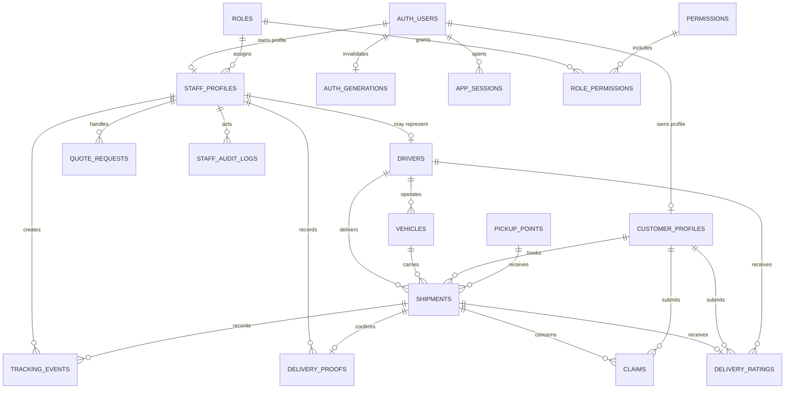

# Dergo24 database

PostgreSQL in Supabase is the system of record. SQL migrations in
[`migrations/`](./migrations/) are authoritative; `migrations/schema.prisma` is
a readable reference model and is not used to deploy the database.

## Relationship map



`AUTH_USERS` is Supabase Auth's `auth.users` table. All other tables shown are
in the `public` schema.

## Table groups

| Area          | Tables                                                          | Purpose                                                                                          |
| ------------- | --------------------------------------------------------------- | ------------------------------------------------------------------------------------------------ |
| Identity      | `customer_profiles`, `staff_profiles`, `drivers`                | Application profiles linked to Supabase Auth; a courier staff member may have one driver record. |
| Authorization | `roles`, `permissions`, `role_permissions`, `staff_audit_logs`  | Normalized RBAC configuration and its audit history.                                             |
| Delivery      | `shipments`, `tracking_events`, `delivery_proofs`, `vehicles`   | Parcel lifecycle, assignment, tracking, and proof of delivery.                                   |
| Customer care | `quote_requests`, `claims`, `delivery_ratings`, `pickup_points` | Quotes, feedback, claims, and collection locations.                                              |
| Security      | `request_limits`, `auth_generations`, `app_sessions`            | Rate limits and hashed application sessions. These are server-only tables.                       |

## Conventions and invariants

- Tables and database columns use `snake_case`; TypeScript uses `camelCase`.
- Primary business records use UUIDs. RBAC lookup tables use integer identity keys.
- All timestamps are `timestamptz` and are stored unambiguously in UTC.
- Monetary columns ending in `_all` store whole Albanian lek (ALL), never floats.
- A pickup-point delivery must reference a pickup point.
- Zero COD uses `not_required`; positive COD moves through `pending`, `collected`, and `settled`.
- Coordinates are nullable; latitude is -90..90 and longitude is -180..180.
- `shipments`, `quote_requests`, and `claims` receive `updated_at` from a database trigger.
- Mutable profiles and operational lookup records also receive `updated_at` from a database trigger.
- Customer and staff profile IDs are foreign keys to Supabase Auth's `auth.users` table.
- Claims must reference a shipment owned by the same customer. Ratings must reference the shipment's customer and assigned driver.
- Driver logins can only be linked to an active staff account with the courier role.
- Tracking events and staff audit logs are append-only to the application service role.
- Foreign keys use `cascade` only for dependent history that cannot stand alone. Operational assignments use `set null`; roles use `restrict`.
- Row-level security is enabled on every application table. The server-only `service_role` performs database access after application authorization.

The structure migration adds new checks as `NOT VALID`: PostgreSQL enforces
them for new or changed rows without making deployment fail on unknown legacy
data. After legacy data is audited, validate them with:

```sql
alter table public.vehicles validate constraint vehicles_capacity_positive;
alter table public.pickup_points validate constraint pickup_points_latitude_range;
alter table public.pickup_points validate constraint pickup_points_longitude_range;
alter table public.shipments validate constraint shipments_cod_state_consistent;
alter table public.shipments validate constraint shipments_pickup_point_required;
alter table public.customer_profiles validate constraint customer_profiles_auth_user_fkey;
alter table public.staff_profiles validate constraint staff_profiles_auth_user_fkey;
alter table public.claims validate constraint claims_shipment_customer_fkey;
alter table public.delivery_ratings validate constraint delivery_ratings_shipment_customer_driver_fkey;
```

Before validating the ownership constraints, investigate any rows returned by:

```sql
select claim.id
from public.claims claim
join public.shipments shipment on shipment.id = claim.shipment_id
where shipment.customer_id is distinct from claim.customer_id;

select rating.id
from public.delivery_ratings rating
join public.shipments shipment on shipment.id = rating.shipment_id
where shipment.customer_id is distinct from rating.customer_id
   or shipment.driver_id is distinct from rating.driver_id;
```

## Safe change workflow

1. Add a new timestamped SQL file; never edit a migration already applied to a shared database.
2. Wrap related DDL in `begin` / `commit` and schema-qualify database objects.
3. Add constraints, indexes, RLS, grants, comments, and rollback considerations together.
4. Apply migrations before deploying API code that depends on them.
5. Update `schema.prisma` and this document whenever the final model changes.
6. Run API type checking, linting, RBAC tests, and read-only database checks.

Useful read-only health checks:

```sql
-- Every public table should report rowsecurity = true.
select tablename, rowsecurity
from pg_tables
where schemaname = 'public'
order by tablename;

-- List constraints that still need validation after a legacy-data audit.
select conrelid::regclass as table_name, conname as constraint_name
from pg_constraint
where connamespace = 'public'::regnamespace and not convalidated
order by 1, 2;
```

## Operations

- Monitor `GET /api/health`; it returns `200` only when the application can reach PostgreSQL.
- Supabase Cron runs `cleanup_expired_security_state()` hourly at minute 17; monitor `cron.job_run_details` for failures.
- Alert on repeated `5xx` responses, failed authentication email delivery, and failed proof uploads.
- Keep database backups enabled and perform a documented restore exercise before accepting irreplaceable production data.
- On the Free plan, run `npm run backup:database` regularly and copy the ignored, sensitive output artifact to encrypted off-site storage.
- Reconcile objects in the private `delivery-proofs` bucket that have no matching `delivery_proofs.photo_path` row.

## Important write boundaries

Shipment lifecycle changes use the atomic functions documented in
[`ATOMIC-WRITES.md`](./ATOMIC-WRITES.md). Application repositories live in
[`../../src/repositories/`](../../src/repositories/) and keep database access
separate from controllers and business services.

Delivery photos are stored privately in the `delivery-proofs` Storage bucket;
only their object path is stored in PostgreSQL. Storage upload and PostgreSQL
confirmation are not one transaction, so orphan cleanup must be reconciled
separately.
